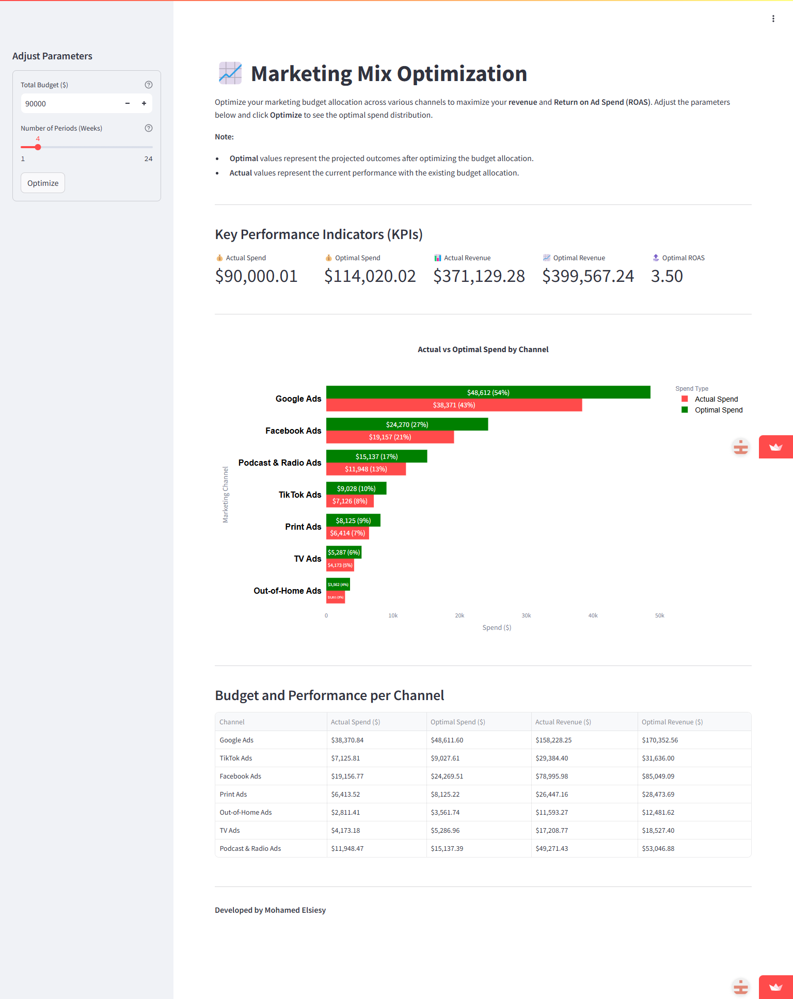
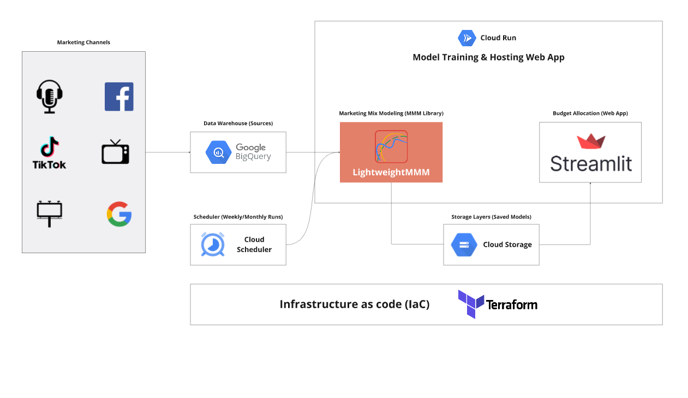

# Budget Allocation Web App | Marketing Mix Modeling | GCP | Terraform

## Overview

This project demonstrates the end-to-end workflow of a Marketing Mix Modeling (MMM) pipeline using a lightweight MMM (LightweightMMM) library on Google Cloud Platform (GCP). It aims to empower marketing teams and analysts to better understand the effectiveness of various marketing channels and inform optimal budget allocations.

## Web App Demo

🚀 [Live Demo](https://mmm-app-mohamed-elsiesy.streamlit.app/) 

*Budget Allocation Web Interface*

## Architecture

*System Architecture Diagram*

## Key Components

- **Data Warehouse (Google BigQuery):** Stores historical marketing spend and performance data
- **Marketing Mix Modeling (LightweightMMM):** Python-based Bayesian modeling library
- **Model Training & Hosting (Cloud Run):** Serverless container environment
- **Storage Layer (Google Cloud Storage):** Model and artifact storage
- **Visualization & Budget Allocation (Streamlit):** Interactive web interface
- **Infrastructure as Code (Terraform):** Automated deployment
- **Cloud Scheduler:** Automated scheduling of model training jobs

## Features

- 🚀 Scalable & Serverless architecture
- 📊 Modular data flows with BigQuery
- ⚙️ Configurable model structure
- 📈 Interactive budget optimization
- 🔄 Automated infrastructure deployment
- ⏰ Automated model retraining with Cloud Scheduler

## Tech Stack

- **Google BigQuery:** Data warehousing and SQL transformations
- **LightweightMMM (Python):** Bayesian MMM modeling
- **Google Cloud Run:** Serverless container execution for both the model and front-end app
- **Google Cloud Storage:** Model artifact and data storage
- **Streamlit:** Interactive UI for budget allocation scenarios
- **Terraform:** Infrastructure as code for consistent and reliable deployments
- **Cloud Scheduler:** Cron job scheduling for automated model training

## Scheduled Training

The model training pipeline is automated using Cloud Scheduler:

- **Frequency:** Weekly retraining on Sunday at 00:00 UTC
- **Trigger:** HTTP POST request to Cloud Run training service
- **Monitoring:** Integrated with Cloud Logging for job execution tracking
- **Error Handling:** Automated alerts on training job failures
